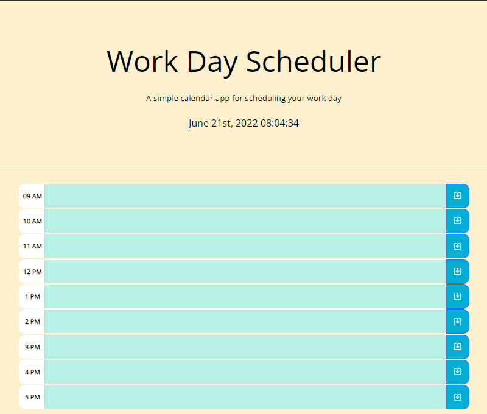
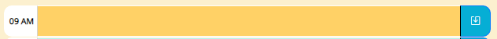
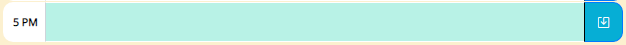
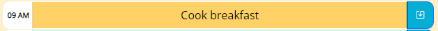

# Daily-Planner-App
  
Welcome to my [Work Day Scheduler App!](https://cagatin.github.io/Daily-Planner-App/)!

## What does this do?
This app enables the user to plan their work day on an hour by hour basis. The app dynamically changes the colors of its time blocks, distinguishing between past, present, and future blocks. 

### Colors of the time blocks
  
A time block displaying the present hour will have a yellow background.  

  
Time blocks that have not occured yet will display a light blue background  

### How is it used?
  
The user can type anywhere within the time block in order to set the event for that specific hour. The user can then click the blue save button on the left hand side to save the event.  

Upon reloading the app, the even still persists until the next day. Should the user want to delete an event, the user can simply remove the text from the timeblock area and click the save button.

### Do events carry over on to the next day?
<strong> No! </strong> The work day will automatically be reset every night once the clock hits 12am. 